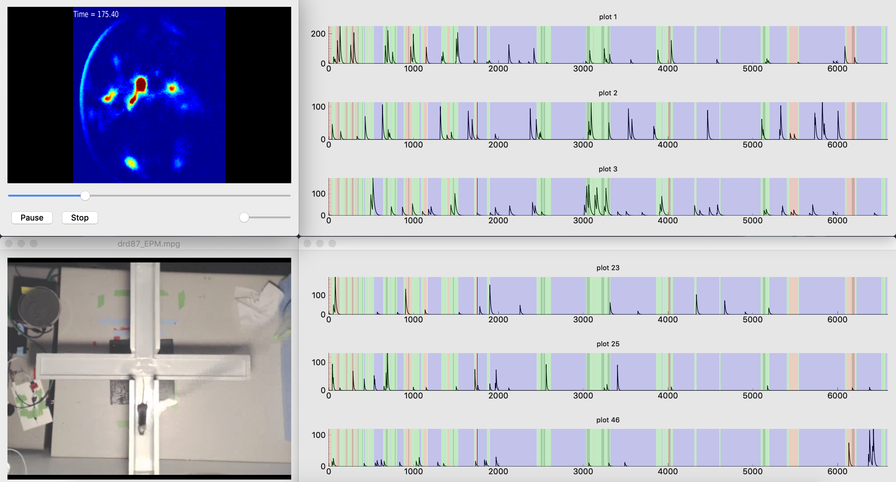

# Data Visualization tool


<sub><sup>movie source: (c) copyright 2008, Blender Foundation / www.bigbuckbunny.org</sup></sub>

<sub><sup>[Creative Commons Attribution 3.0](https://creativecommons.org/licenses/by/3.0)</sup></sub>

## Getting Started

1. Download and install [VLC media player](https://www.videolan.org/vlc/index.html)

2. If you do not have Anaconda already installed, then download and install [Anaconda](https://docs.anaconda.com/anaconda/install/) (Python 3.X)

3. Navigate to the `gui` directory

4. Run the following commands:

### macOS & Linux

```Bash
conda env create -f environment.yml
source activate data_vis_env
python main.py
```

### Windows

```Bash
conda env create -f environment.yml
activate data_vis_env
python main.py
```

